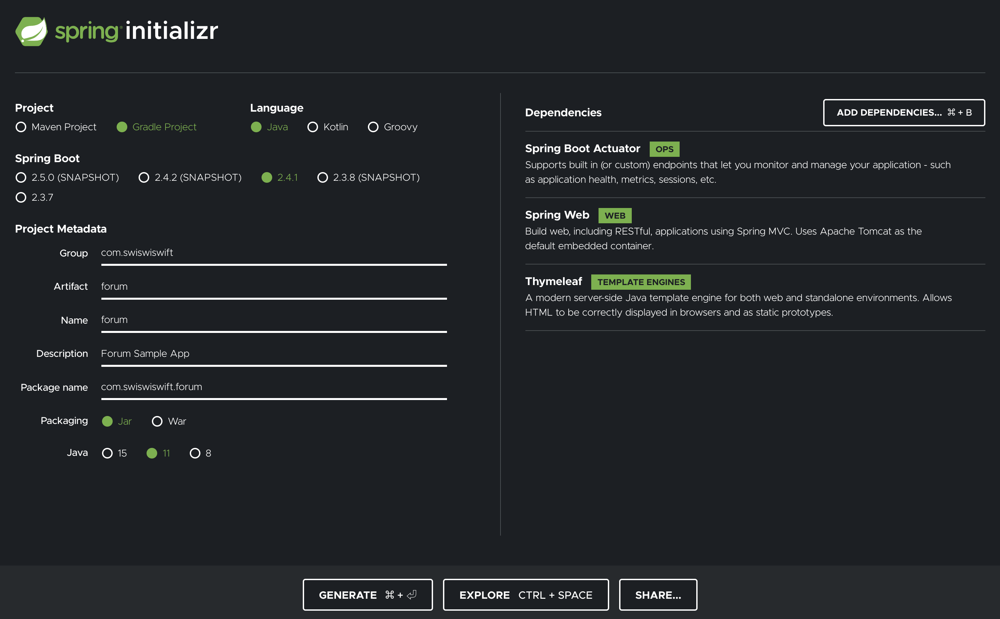

## SpringBoot で簡単な掲示板を作成する

SpringBootを使って簡単な掲示板を作成するサンプルです。

### プロジェクトの作成

まず最初 [Spring Initializr](https://start.spring.io/) でプロジェクトを作成します。
Gradle + Java11 のプロジェクトを作成し、Dependencies には Spring Boot Actuator, Spring Web, Thymeleaf を追加します。




### DBの作成

次にデータベースを用意します。
今回は Docker を使って MySQL を用意します。
以下のような `docker-compose.yml` と `forum.ddl` を作成します。

``` 
version: "3.7"
services:
  forum-db:
    image: mysql:8.0.20
    environment:
      MYSQL_ROOT_PASSWORD: password
      MYSQL_DATABASE: forum
    command: mysqld --character-set-server=utf8mb4 --collation-server=utf8mb4_unicode_ci
    ports:
      - 3306:3306
    volumes:
      - ./forum.ddl:/docker-entrypoint-initdb.d/0.sql
```

```
set
    character_set_client = utf8mb4;
set
    character_set_connection = utf8mb4;

create table post(
    post_id bigint not null auto_increment,
    nickname varchar(63) not null,
    message varchar(1023) not null,
    post_datetime datetime not null,
    primary key(post_id)
) engine = InnoDB default charset = utf8mb4 collate = utf8mb4_bin comment '投稿情報';
```

`docker-compose.yml` があるディレクトリで `docker-compose up -d` コマンドを実行すると MySQLサーバーを起動させることができます。
MySQLサーバーを止めるときは `docker-compose down` コマンドを実行します。データも一緒に消えるので注意が必要です。

MySQLサーバーへログインする場合は以下のコマンドでログインすることができますが、ローカルに MySQL を入れる必要があります。

```
mysql --host 127.0.0.1 --port 3306 -u root -p  # password
```


### APIを作成

投稿APIと投稿取得APIを作成します。 
Spring Initializr を IntelliJ で開き、`build.gradle` に以下を追加します。

```
implementation 'org.springframework.boot:spring-boot-starter-data-jpa'
runtimeOnly 'mysql:mysql-connector-java'
implementation group: 'com.fasterxml.jackson.core', name: 'jackson-core', version: '2.11.1'
compileOnly 'org.projectlombok:lombok:1.18.12'
annotationProcessor 'org.projectlombok:lombok:1.18.12'
```

`application.properties` にDBの接続情報を追加します。

```
spring.datasource.url=jdbc:mysql://127.0.0.1:3306/forum
spring.datasource.username=root
spring.datasource.password=password
spring.datasource.driverClassName=com.mysql.cj.jdbc.Driver
spring.jpa.database=MYSQL
```


[Post.java](https://github.com/takoikatakotako/spring-forum-sample/blob/master/src/main/java/com/swiswiswift/forum/Post.java) を作成します。


[PostRepository.java](https://github.com/takoikatakotako/spring-forum-sample/blob/master/src/main/java/com/swiswiswift/forum/PostRepository.java) を作成します。


`ForumController.java` を追加。

```
package com.swiswiswift.forum;

import lombok.AllArgsConstructor;
import org.springframework.stereotype.Controller;
import org.springframework.ui.Model;
import org.springframework.web.bind.annotation.*;

import javax.servlet.http.HttpServletResponse;
import java.time.LocalDateTime;
import java.util.ArrayList;

@Controller
@AllArgsConstructor
@RequestMapping("/")
public class ForumController {

    private final PostRepository postRepository;

    @ResponseBody
    @RequestMapping(value = "/api/list", method = RequestMethod.GET, produces = "application/json;charset=UTF-8")
    public ArrayList<Post> getPostList(HttpServletResponse response) {
        return new ArrayList<>(postRepository.findAll());
    }

    @ResponseBody
    @RequestMapping(value = "/api/add", method = RequestMethod.POST, produces = "application/json;charset=UTF-8")
    public String addPost(@RequestBody PostRequestBean postRequestBean, HttpServletResponse response) {
        Post post = new Post();
        post.setNickname(postRequestBean.getNickname());
        post.setMessage(postRequestBean.getMessage());
        post.setPostDatetime(LocalDateTime.now());
        postRepository.save(post);
        response.setStatus(HttpServletResponse.SC_OK);
        return "Success";
    }
}
```


[PostRequestBean.java](https://github.com/takoikatakotako/spring-forum-sample/blob/master/src/main/java/com/swiswiswift/forum/PostRequestBean.java)を追加


投稿一覧を取得

```
curl -X GET -H "Content-Type: application/json" localhost:8080/api/list | jq
```

投稿一覧を取得


```
curl -X POST -H "Content-Type: application/json" -d '{"nickname":"Kabigon", "message":"ZZZZZZZZZZZ"}' localhost:8080/api/add
```


[index.html](https://github.com/takoikatakotako/spring-forum-sample/blob/master/src/main/resources/templates/index.html) を追加


[ForumController.java](https://github.com/takoikatakotako/spring-forum-sample/blob/master/src/main/java/com/swiswiswift/forum/ForumController.java) にエンドポイントを追加。


```
@RequestMapping(value = "", method = RequestMethod.GET)
public String healthCheck(Model model) {
    ArrayList<Post> posts = new ArrayList<>(postRepository.findAll());
    model.addAttribute("posts", posts);
    return "index";
}
```


完了！